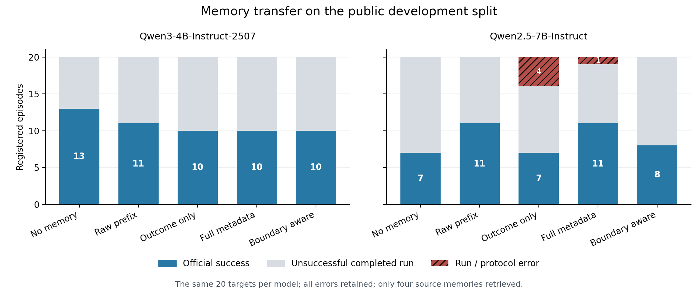

# Learning from Interrupted Tool Use: Separating Recorded Outcomes from Experience Claims

**Working manuscript, incomplete.** The methods below are implemented and the
baseline observations are reproduced. The complete developmental memory-transfer
comparison does not support the proposed instruction's benefit. Independent
confirmation and a publication-level contribution are not yet established.
This file is not a submission-ready paper.

## Abstract

Tool-using agents often retain compressed lessons from past executions. A
recorded failure can arise because an agent completed an unsuccessful attempt
or because an external execution limit ended an unresolved attempt. Both can
legitimately receive zero reward, while supporting different claims about
which actions should be avoided in future tasks. We study this distinction
through a controlled transfer protocol that keeps the source trajectory,
retrieval decision, target task and evaluator fixed. The protocol separately
varies whether a curator sees execution-boundary metadata and whether it is
instructed to account for that metadata. An initial audit of 40 telecom
episodes from two open models finds no instances in which the official task
requirements had been fulfilled before an eventual unsuccessful termination.
This observation prevents a missing-termination explanation from being used
as a general explanation of the observed failures. Offline trajectory cuts
nevertheless provide directly observed examples of unresolved prefixes whose
recorded continuations later succeed. A complete five-condition transfer study
contains 200 episodes over the same 20 development tasks and two checkpoints.
Boundary-aware curation, compared with curation receiving the same metadata,
produces identical binary outcomes for Qwen3-4B (10/20 in both conditions) and
three losses without a gain for Qwen2.5-7B (8/20 versus 11/20). Five protocol
exceptions across other curated arms remain unsuccessful in the primary
comparison. Qualitative inspection identifies unsupported causal and temporal
claims even in boundary-aware lessons. These observations do not support a
general benefit from the additional instruction and motivate separating source
evidence fidelity from target applicability in subsequent investigations.

## 1. Introduction

An agent's execution record is an observation under a particular interaction
and compute budget. Turning that record into a reusable lesson introduces an
additional inferential step. A statement such as “the task was not completed
within eight generations” describes an observed outcome. A recommendation
such as “avoid this diagnostic procedure because it is ineffective” goes
beyond that outcome. The recommendation may be useful when supported by a
contradictory tool result, but a deadline alone does not justify it.

This distinction matters because memory is used outside the execution in
which it was written. A future task may have different entities, a different
initial state, or enough budget to finish a procedure that was previously
interrupted. Conversely, extending an execution does not guarantee success:
an agent can repeat irrelevant diagnostics, modify the wrong entity, or
terminate with a genuinely unresolved problem. A useful evaluation must test
the consequences of the resulting memory rather than reward a plausible
verbal explanation of the source trajectory.

We investigate this issue using fixed-policy offline cuts followed by
cross-task transfer. The source agent does not receive a different budget
instruction for each cut. Instead, a completed execution supplies a common
history from which observed prefixes are constructed. A curator sees only
the selected prefix and permitted execution metadata; the recorded suffix
is reserved for analysis. This construction separates a change in observed
experience from a change in the policy that generated the experience.

The central empirical question is whether accounting for the origin of
termination changes the usefulness of a lesson on a different task. The
present experiment is developmental. Its prompt controls do not yet establish
a new general memory algorithm, and its small target split cannot support
broad claims across agent environments.

## 2. Problem formulation

Let an execution under a fixed policy produce a history H containing agent
generations and environment responses. A generation may include several tool
calls. We define H_b as the prefix ending after at most b complete generation
groups, including every corresponding tool response. This avoids inventing
a partial observation in which an action is visible but its already-produced
response is hidden.

Let S_b record whether the prefix ends at the original recorded termination
or at an externally imposed cutoff. Let R_b be the supplied completion label:
the original recorded reward when its termination is reached, and zero for an
externally cut, nonterminal prefix. This assignment follows the pinned
evaluator's rule that premature termination receives zero, even when an
analysis-only state predicate is already true. The imposed cut is a research
intervention, not an independently observed natural termination. We retain
the distinction between state satisfaction and benchmark success rather than
changing the evaluator or replacing this label after inspecting hidden state.

A curator C produces a memory M from the permitted observation. The target
agent executes a different task x with the current official policy and M,
and receives the official reward Y(x, M). Our development estimand is the
paired change in Y induced by the curation condition while holding the
retrieved source episode fixed. It is not the effect of extra source budget,
the effect of a new retriever, or a claim about a hidden reasoning process.

The full recorded source continuation can answer a limited descriptive
question: did this particular fixed-policy execution later succeed? It cannot
prove that every prefix action was beneficial, that every interrupted failure
would eventually succeed, or that suppressing a negative lesson improves
another task. Consequently, continuation labels are excluded from both memory
construction and source selection.

## 3. Controlled experience transfer

### 3.1 Source observations and information separation

The source pool is the official telecom train split of tau2-bench. The initial
memory pool uses Qwen3-4B-Instruct-2507 trajectories at generation cutoff eight.
Cuts at four and sixteen, and a second source model, are retained for later
development analyses. Every eligible source record enters the pool without
selection by eventual reward. Execution exceptions remain separately counted;
they cannot be silently replaced by successful runs.

The visible payload includes the source policy and ticket, observed messages,
generation counts, stopping origin and finite-budget reward. Future reward
and continuation existence are written to a separate labels directory. The
curation program reads only visible inputs and rejects unexpected payload
fields. The bank compiler verifies that every source has a generated memory
in every curated condition and that the exact prompt matches its registered
condition. Missing or failed curation stops compilation.

### 3.2 Experimental conditions

The no-memory control supplies only the current official policy and ticket.
The raw-memory control supplies the selected source ticket, observed actions
and responses, boundary metadata and reward, without a generated lesson. The
source domain policy is omitted from raw memory because it is already supplied
as the current policy.

Three curated conditions share a common instruction to produce a concise
lesson containing observations, an actionable recommendation and applicability
limits. Outcome-only curation omits stopping metadata. Full-metadata curation
adds the observed stopping origin and generation counts. Boundary-aware
curation receives exactly the full-metadata evidence, together with an
instruction that an external deadline alone does not establish strategy
failure and that negative advice requires observed support.

The full-metadata/outcome-only contrast tests additional information. The
boundary-aware/full-metadata contrast tests an additional instruction given
the same information. All curated conditions use the same checkpoint, greedy
decoding and 256-token output ceiling. Actual memory lengths can differ, so
equal ceilings do not provide an exact length control. Raw memory can also
be substantially longer. Both source curation and target inference costs
must therefore accompany any performance comparison. A development quality check
found that the initial unconstrained lesson format often exhausted 256 tokens
before completing its components. The target pilot was stopped while only
no-memory workers had started. The revised protocol applies a shared
three-sentence, at-most-90-word request to every curated arm and refuses to
compile a bank containing a token-ceiling output. Original generations and
partial baseline records remain archived; this revision was made before any
memory-treatment result was collected.

### 3.3 Retrieval and target execution

One source record is retrieved by TF-IDF cosine similarity between source and
target ticket words. Numeric and mixed alphanumeric identifiers are excluded
from retrieval tokens. Document frequencies and tie-breaking order are fixed
before condition comparison. The retriever does not inspect generated lessons,
future rewards, hidden task identifiers or evaluation criteria. Exact ties
are recorded because limited ticket diversity can make the selected episode
depend heavily on the tie-breaking rule.

The pre-treatment audit finds exact ties for all 20 target tickets, resulting
in only four distinct selected source records, used by three, five, six and
six targets. Thus the first comparison is conditional on four shared memories.
It cannot establish robustness across arbitrary source experiences. Broader
claims require outcome-independent variation of the tie selection and must
retain dependence induced by reused memories and related target families.

Every memory condition uses the same selected source record for a target
ticket. The current official policy and ticket remain verbatim. A shared
wrapper marks prior experience as quoted, potentially inapplicable material.
The model does not receive the source record ID or condition name. Those
values are retained only in the audit trail. The initial target set is the
20-task small split, evaluated separately with Qwen3-4B-Instruct-2507 and
Qwen2.5-7B-Instruct.

## 4. Evaluation protocol and observed baseline

We pin [tau2-bench](https://arxiv.org/abs/2506.07982v1) to commit b7ea9074c1cba482b30687fecdb5c8425fd6f619 and verify
the imported implementation against a source-and-data manifest. We use the
official solo telecom transitions and evaluator with 60 message steps and at
most five environment errors. Native model chat templates receive the same
opening tool-call marker in every condition. Each call permits 512 newly
generated tokens and uses greedy decoding. The supplied marker is recorded
separately from generated text; it is a formatting baseline, not a proposed
research contribution.

The task identities in small, train and test are pairwise disjoint. Hashes of
the visible ticket plus complete initial state are also unique within and
disjoint across those splits. These checks rule out exact identity overlap,
not shared templates or related task families. The test split has not been
used for outcome-based selection.

On the completed 20-task small-split baseline, Qwen3 succeeds on 13 tasks and
Qwen2.5 succeeds on seven. All 40 episodes have complete traces and no run or
protocol exceptions. Qwen3 terminates voluntarily in 19 episodes and reaches
the step limit in one. Qwen2.5 terminates voluntarily in 14, reaches the step
limit in five and reaches the error limit in one. These descriptive rates are
development observations, not treatment improvements or state-of-the-art
comparisons.

The fresh no-memory arm under the memory-capable adapter reproduces all 40
prior baseline trajectories. Matching model and task identities, every model
input, tool schema, decoded reply and generated token sequence is identical;
the official rewards also match. We exclude wall-clock timing and simulation
identifiers from this comparison. This checks control reproducibility across
the adapter revision, without increasing the number of independent tasks.

Replaying the official state and action requirements at every complete prefix
finds that exactly the 20 ultimately successful episodes ever satisfy the
requirements. There is no observed success-to-failure reversal and no episode
that satisfies the requirements but receives an unsuccessful final benchmark
outcome. Thus a missing final submission, observed in a separate synthetic
pilot, does not explain the unsuccessful public-benchmark episodes here.

At generation cutoff eight, 14 Qwen3 and 16 Qwen2.5 episodes still have an
unobserved recorded continuation. Seven and four of those continuations,
respectively, later succeed. These counts establish ambiguity in interpreting
some finite-prefix failures. They do not establish that a particular memory
method resolves it or improves target reward.

The complete Qwen3 train-source pool contains 74 executions, with 14 official
successes and no run or protocol exceptions. Of these, 71 end with agent stop
and three at the message-step limit. The same prefix-state replay again finds
no satisfied-but-unsuccessful episode and no satisfaction reversal. At source
cutoff eight, 69 records are externally interrupted; ten of their recorded
continuations later succeed. Four source executions have already ended
successfully by that cut.
Two of the 69 externally cut prefixes already satisfy the offline state and
action checks at generation eight; both eventually terminate successfully.
The remaining eight of the ten successful continuations have not yet satisfied
those checks at the cutoff. This separates an unfinished termination protocol
from an unfinished task state within the constructed prefixes. It does not
contradict the absence of satisfied-but-unsuccessful full recorded episodes.
The same join across cuts is shown below; its rows reuse the same sources.

**Table 1. State satisfaction and observed continuations at three source cutoffs.**

| Generation cutoff | Externally cut / 74 | Already satisfied among cut prefixes | Unsatisfied at cut, recorded continuation succeeds |
|---|---:|---:|---:|
| 4 | 74 | 0 | 14 |
| 8 | 69 | 2 | 8 |
| 16 | 63 | 1 | 6 |

These are joins to the previously completed strict state replay, not new
model executions. Hidden diagnostic labels remain excluded from curation,
retrieval and target policy inputs. All 74 sources, including completed
unsuccessful attempts, remain eligible for
the fixed memory bank. The success rate of this source pool must not be pooled
with the small-split target rate or interpreted as a treatment effect.

### 4.1 Complete developmental transfer results

The registered grid completed all 200 episodes: five conditions, two target
checkpoints and twenty target identities. All twenty worker processes exited
normally. Five episode-level protocol exceptions occurred within these
workers; they remain in the denominator as unsuccessful episodes. We checked
the complete condition coverage, source/target identity separation, bank and
task hashes, checkpoint and package manifests, and the selected source for
every model-task-condition combination before calculating the comparisons.

**Table 2. Completed developmental transfer grid with errors retained.**

| Memory condition | Qwen3 success / 20 | Qwen2.5 success / 20 | Qwen2.5 protocol exceptions |
|---|---:|---:|---:|
| None | 13 | 7 | 0 |
| Raw observed experience | 11 | 11 | 0 |
| Outcome-only lesson | 10 | 7 | 4 |
| Full-metadata lesson | 10 | 11 | 1 |
| Boundary-aware lesson | 10 | 8 | 0 |

Qwen3 has no protocol exceptions in any condition. In the primary paired
boundary-aware/full-metadata comparison, Qwen3 has zero gains and zero losses:
the successful task sets are identical. Qwen2.5 has zero gains and three
losses, a descriptive decrease of 15 percentage points. The losses concern
the Data Saver task and two application-permission tasks. The additional
boundary instruction therefore shows no demonstrated benefit in this grid.
This does not prove that every treatment effect is zero, nor that boundary
information is universally harmful.

Against no memory, raw and full-metadata experience each give Qwen2.5
five gains and one loss. Qwen3 loses two tasks with raw experience and three
with each curated arm, without gains. These development observations concern
two checkpoints and four retrieved memories. They do not establish general
improvement, and the four outcome-only exceptions remain unsuccessful.

*Figure 1. All registered episodes in the developmental transfer grid. Red
segments denote protocol exceptions retained as unsuccessful. The bars reuse
the same twenty task identities; they are not independent samples of new tasks.*

Recorded target generation time sums to approximately 7,160 seconds across
the grid; worker wall time sums to 7,870 seconds and overall elapsed batch
time is 2,320 seconds. These measure different quantities and are not energy
or full-GPU-utilization estimates. Curating the complete 74-record bank costs
an additional 248.3, 249.3 and 247.8 generation seconds for outcome-only,
full-metadata and boundary-aware lessons, respectively, incurred once per
bank and shared across target checkpoints. These values exclude source
collection. Lower generation time can reflect early protocol failure and
must not be interpreted as efficiency at equal success.

An offline strict replay audits all 155 normally completed memory-treatment
trajectories. Exactly their 78 officially successful episodes ever satisfy
the task requirements; none loses satisfaction later or satisfies the final
requirements while receiving zero reward. For the five protocol exceptions,
we reconstruct only the executed history in the final model input, excluding
the invalid output. The same reconstruction matches saved simulation prefixes
in all 195 normally completed grid episodes. None of the five exception
prefixes satisfies the task requirements. Three exceptions emit a status-bar
call without an arguments object; two emit a similarly malformed done call.
These are protocol failures, but the recorded histories do not support
reclassifying them as completed tasks. Diagnostic hidden-state checks occur
only after collection and are never exposed to the policy or curator.

### 4.2 Source evidence and lesson claims

We inspected the three compact lessons for each of the four sources selected
by the frozen retriever. These sources were selected before target outcomes,
but they are not a random sample of all 74 records. The audit concerns what
the observed prefix supports; it does not use the withheld continuation to
judge what a curator could have known.

In the MMS source, the agent observes failure, resets the APN, reboots, and
observes failure again. All three lessons describe APN misconfiguration as
confirmed by the inability to send MMS, although that observation does not
identify a cause. The full-metadata lesson goes further and claims the reset
resolves the issue, contradicting the final tool observation within its own
input. The boundary-aware lesson avoids the explicit success claim but retains
the unsupported diagnosis. Thus recognizing an execution boundary does not
automatically correct causal overstatement.

A second source checks for a missing SIM and then reseats it. The tool reports
successful reseating but the status bar still shows no signal. The
boundary-aware lesson describes the SIM as undetected after reseating, even
though no post-action SIM-status check appears in the prefix. Lack of signal
and lack of SIM detection are distinct state variables. In a third source, a
failed speed test becomes an assertion that the remaining issue is beyond
agent control, although visible Data Saver and VPN settings have not been
ruled out. These errors concern temporal scope and the strength of a claim,
rather than missing output punctuation or a malformed memory record.

The fourth source ended successfully after disabling airplane mode and
enabling data. Its boundary-aware lesson gives an observation-supported
airplane-mode explanation with an explicit applicability condition. A faithful
source summary can therefore coexist with an imperfect retrieval decision:
the same generic ticket can describe several different current causes. Source
grounding and target applicability should be evaluated separately. The
inspection identifies hypotheses for controlled interventions, not causal
attribution of a downstream failure to any particular sentence.

### 4.3 Inspection of the frozen test-selected source lessons

Before obtaining target outcomes for the test extension, we inspected all
three compact lessons for each of its fifteen selected source IDs. This is
a descriptive review by the same Codex assistant conducting the study, with
condition names visible; it is not independent human adjudication. The review
records seventeen claim-level examples with exact lesson quotations and
references to source tool responses. These examples include supported claims
and qualified hypotheses as well as contradictions and unsupported assertions.
They are not an exhaustive factuality labeling, so we do not derive an error
rate from seventeen examples or forty-five lesson instances. One source pair
has identical histories and lessons and supplies no additional independent
claim evidence.

The extended inspection identifies an explicit state contradiction: an
outcome-only lesson says the device operates on 2G, while every network-type
observation in that prefix reports 5G. Its boundary-aware counterpart claims
that a data toggle and network-preference change resolved the issue. The only
speed test fails between those two actions; no test follows the last action.
The claimed post-action resolution is therefore unverified, rather than
demonstrably contradicted by a later failed test. Keeping these labels distinct
prevents an unknown later outcome from being treated as observed failure.

Another selected source illustrates entity scope. Its ticket identifies a
phone number ending in 2002, but the sole account-line lookup returns a
different phone number ending in 2001 with account roaming disabled. All
three compact lessons state that the user's line is not roaming enabled.
The source also observes device roaming disabled, but a device setting does
not establish the target account line's state. The recommendation may be
worth checking; the asserted target-line observation is unsupported. This
is an instance of an existing entity-binding problem, not a new failure class
introduced by the boundary intervention.

We also retain counterexamples to a uniformly negative interpretation of
cutoff memories. One externally cut source has completion reward zero but
ends with an excellent speed-test observation. All three lessons give positive
connectivity advice. Another boundary-aware lesson accurately says a speed
test still fails after the listed actions and qualifies its recommendation
pending further diagnostics. Thus reward zero does not invariably become
negative advice, and the boundary-aware condition does not invariably discard
failure evidence. These source observations cannot identify which sentence,
if any, causes a downstream target outcome.

## 5. Analysis requirements and limitations

### 5.1 Frozen test-split extension

After the developmental comparison, we froze a second evaluation on all 40
official telecom test identities. This extension retains the same source bank,
curation prompts, target decoding and environment limits. It compares only
full-metadata and boundary-aware lessons, with one shared no-memory control
per target checkpoint. Neither eventual source reward nor target outcomes
enter retrieval. This is an evaluation on previously unused task identities,
not an independent environment or a new source-memory sample.

Every test ticket has a tied highest-scoring source set. In addition to the
original smallest-record-ID rule, we registered two alternative choices by
hash-ranking the remaining tied source IDs with a fixed seed. These choices
are deterministic sensitivity settings, not three independent random seeds.
They select five sources per rule, reused across target groups of 13, 3, 8,
1 and 15 tasks. All three rules and their paired comparisons will be reported;
we do not choose the best-performing rule after collection.

For checkpoint m and registered tie rule r, let Y(m,r,c,x) denote official
binary success on target x under memory condition c. The primary contrast is
the finite-set mean of Y(m,record_id,boundary_aware,x) minus
Y(m,record_id,full_metadata,x) across the 40 targets. The two alternative-rule
contrasts are sensitivity analyses. The seven executions per checkpoint and
target—one control and six memory treatments—give 560 registered episodes.
Protocol exceptions remain unsuccessful. A shared control is never replicated
as if three separate no-memory samples had been collected.

Before collecting test outcomes, a literal-content audit found that the 74
source IDs contain only 52 distinct raw memories, 51 outcome-only lessons,
51 full-metadata lessons and 50 boundary-aware lessons. In the group shared
by 15 test targets, the two alternative IDs supply identical raw, full-metadata
and boundary-aware content. Source IDs and condition names are absent from
model input. Thus 60 pairs of registered memory executions have identical
memory content across those two rules, rather than providing distinct lesson
interventions. We keep both executions and compare complete model inputs,
tool definitions, generated token sequences and rewards as reproducibility
checks. Timing and source-selection bookkeeping are excluded. Different text
hashes elsewhere do not establish semantic diversity or independent evidence.

The primary estimate weights each task equally. An additional descriptive
analysis weights the five visible-ticket groups equally and reports each
leave-one-group-out estimate. This changes the weighting of the estimand;
it does not correct dependence or provide a confidence interval. With only
five groups, three deliberately chosen source rules and two fixed checkpoints,
we do not interpret these values as population-level uncertainty estimates.
The frozen extension is queued; no test outcome or effect is reported here.

### 5.2 Registered structured-curation extension

A further extension applies the paired boundary instruction within an
NK-schema adaptation. The curator retains the prior method's six-field
representation and fixed failure vocabularies, but reads telecom prefixes
instead of scientific code and logs. It is not a reproduction of the complete
Negative Knowledge procedure. Both new arms use the same 1,024-token curation
ceiling and the same Qwen3 checkpoint. Visible zero-reward eligibility yields
70 source records. The remaining four successful records are excluded before
curation and retrieval, never according to downstream outcomes.

The endpoint comprises all 40 official test tasks, both target checkpoints
and both new conditions: 160 registered episodes. These reuse the preceding
test task identities and are not an additional independent sample. Frozen
ticket-based retrieval selects five sources with reuse 13/3/8/1/15; one task's
source identity differs from the original 74-source selection. If a chosen
curation is invalid or fails to generate, that source remains selected and
an empty experience is supplied under the common wrapper. No alternate
retrieval or target exclusion follows from generation quality.

The primary contrast is boundary versus base NK-schema curation within each
checkpoint. Its changed pool and larger curation ceiling prevent attributing
differences from the earlier generic-curation study to representation alone.
Code and task-selection preflights have passed, but new curation and target
outcomes are still pending. No accuracy result or benefit is reported here.

### 5.3 Interpretation limits

The primary development comparison is paired target success for boundary-aware
versus full-metadata memories, separately by target checkpoint. The complete
grid reports every registered condition, task and failure. Episode audits should
distinguish changed entity selection, environment errors, repeated observation,
termination and state satisfaction. Syntactic tool validity is not task success.

The 20 development identities remain 20 tasks even when evaluated with several
models, cutoffs or conditions. Repeated deterministic executions do not create
independent samples. A confirmatory study requires a frozen method and analysis,
appropriate family-level dependence handling, uncertainty estimates and an
independent evaluation set. Any development tuning must be disclosed.

The current intervention is intentionally simple. Instruction-sensitive gains
could reflect wording, lesson length or compression choices. A publishable
method claim would require stronger memory baselines and controls addressing
these alternatives. The static cross-task reflection control is not an exact
reproduction of [Reflexion](https://arxiv.org/abs/2303.11366v4), whose original protocol learns across repeated
trials of a task and already includes action-limit-related reflection triggers.
No claim of being the first budget-sensitive agent-memory study is warranted.

## 6. Relation to existing memory methods

[How Memory Management Impacts LLM Agents](https://aclanthology.org/2026.acl-long.27/)
already studies harmful experience reuse, error propagation and memory
selection using subsequent task feedback. Its fixed-memory and deletion
comparisons show that source-record quality and downstream usefulness need
not coincide. Our observation of unhelpful transfer from a source-supported
lesson therefore does not introduce that distinction. The narrower variable
here is the treatment of a researcher-imposed execution boundary while
holding the source record and retrieval choice fixed. We have not reproduced
the prior work's adaptive deletion procedure or established superiority over it.

[Negative Knowledge](https://arxiv.org/html/2606.21024v1) represents failures
with typed layers, scope, evidential degree and recommended actions, and asks
downstream agents to justify adoption or rejection. Its schema already allows
inconclusive records. Consequently, adding an uncertainty label is not a
distinct contribution. A stronger comparison must implement its evidence and
adoption structure; our current generic reflection controls do not reproduce
that method.

A separate NK-schema adaptation has now been prepared, but has not generated
memories or target outcomes. It retains the six-field representation and
closed failure vocabularies while changing the input to telecom prefixes.
Visible zero-reward eligibility leaves 70 of the 74 source records. This
changes the retrieval pool, so its future comparison with the original bank
would not isolate representation alone. Its paired boundary-instruction
contrast uses identical evidence and a common larger output ceiling.
The preparation does not implement the full upstream adoption procedure.

[Grounding Agent Memory](https://arxiv.org/html/2609.11060v1) lets a post-task
curator inspect an environment through read-only probes before updating
memory. The present protocol restricts curation to a recorded prefix and its
termination metadata. This is a different evidence-access condition, not
evidence of superiority. If probing is added in a later experiment, its access
to source state and its cost must be explicit; simply adding verification
would overlap with that prior method.

[Agent Workflow Memory](https://arxiv.org/html/2409.07429v1) induces reusable
workflows and supports both offline and online use. Our fixed source-bank
setting therefore does not itself establish novelty. The narrower variable
under investigation is the interpretation of an imposed execution boundary
when compressing otherwise matched experience. Whether that variable supports
a useful method or a general empirical finding remains to be tested.

[Auditing Self-Evolution in Financial Agents](https://arxiv.org/html/2608.17684v1)
compares memory and workflow systems using matched acquisition trajectories
and identifies an execution-interface mismatch in an AWM port. Thus matching
source evidence and checking the native action interface are established
evaluation concerns. Our controlled curation study must also separate these
implementation effects from memory content. We have not reproduced that
financial-agent evaluation.

## 7. Discussion

### 7.1 Completion labels constrain claims, not recommendations by themselves

The cutoff audit separates three questions: whether the evaluator awards
completion, whether the task's state and action checks are already satisfied,
and whether the recorded continuation eventually succeeds. These variables
cannot be substituted for one another. In particular, zero completion at an
imposed cutoff does not identify an ineffective action. Conversely, eventual
success does not validate every action in the preceding prefix. A lesson can
accurately describe an unsuccessful intermediate test and still recommend a
reasonable next step. Our selected-source review includes such cases; it does
not support a universal conversion from zero reward to negative advice.

Boundary metadata resolves the origin of the supplied label, but it supplies
no missing environment observation. A curator told that execution was cut
short still cannot know the unobserved result of a final intervention. This
explains the logical limitation of the treatment without claiming to explain
its observed target losses causally. The qualitative review finds temporal
overstatement in some boundary-aware lessons, but the experiment does not
intervene on those individual statements while keeping all other words fixed.
It therefore cannot attribute a particular failed target to a particular
unsupported sentence.

### 7.2 Source fidelity and target utility require separate evidence

A lesson may faithfully describe one source and remain inapplicable to a
different target state. An unsupported lesson can also coincide with a useful
target action. Thus neither target reward nor a source quotation alone is a
complete measure of memory quality. Our experiment measures official target
reward and provides selected source-level examples separately. It does not
combine them into an unvalidated quality score. The 17 reviewed examples are
illustrations selected after reading all 45 test-selected lessons, not an
exhaustive annotation of atomic claims or a factual-error percentage.

Holding source identity fixed makes the instruction contrast interpretable
within the current pipeline, but does not isolate a universal mechanism of
boundary reasoning. The instruction may change wording, length, selected facts
and recommended actions simultaneously. Greedy curation supplies one lesson
per source and condition, not a distribution of possible lessons. The current
results consequently concern these concrete memories produced by this curator.
A claim about memory algorithms generally would require additional curators,
matched content controls and other environments.

### 7.3 Retrieval dependence limits the effective diversity

Task counts do not describe the full diversity of a memory-transfer study.
All development targets share only four selected source records; the test
extension uses five under each rule. Literal duplicate lessons further reduce
the number of different interventions. Repeating an identical lesson under a
different source ID is useful for detecting execution instability, but cannot
establish robustness to new experience content. The frozen analyses preserve
each task and each rule while reporting this reuse explicitly.

The test extension addresses previously unused task identities and selected
source-choice sensitivity. It does not remove dependence between related
telecom tasks, provide an independent human review, or compare the complete
procedures of the closest memory methods. Those are limits on the scientific
claim, even if a future completed comparison were to show positive counts.

## 8. Provisional conclusion

The completed development experiment provides no evidence of a general
advantage from adding a boundary-aware instruction to the same curation
evidence. The source audit nevertheless demonstrates why a recorded completion
label is insufficient to justify claims about action effectiveness, and why
boundary metadata cannot replace missing observations. The principal supported
lesson is methodological: report source evidence, termination origin, retrieval
reuse and downstream task outcomes separately. The registered test extension
is still pending, so this conclusion is limited to the completed development
study and the descriptive source audit.

## Data, code and use of language models

The code, frozen protocols and analysis programs are maintained on the
`codex/agent-paper-research` branch of
[Jing-XING/autoresearch](https://github.com/Jing-XING/autoresearch/tree/codex/agent-paper-research).
`reproduce.md` specifies artifact identities and analysis commands;
`claim_to_evidence.md` maps the completed developmental claims to their records.
The raw execution archives are retained locally and are not yet a complete
public release. The test and structured-curation registrations precede their
outcome analysis. Their pending results must not be inferred from development.

A language-model assistant performed literature retrieval, implementation,
experiment operation, source-claim inspection, analysis and drafting.
The qualitative source review was unblinded and has no independent human
adjudication. Numerical development results derive from recorded executions
and the pinned official evaluator. Author identities, affiliations, funding
and accountability declarations remain to be supplied by the responsible
human authors; they have not been invented by the assistant.

## References

Barres, Victor; Dong, Honghua; Ray, Soham; Si, Xujie; and Narasimhan, Karthik.
2025. tau2-Bench: Evaluating Conversational Agents in a Dual-Control
Environment. arXiv:2506.07982, preprint.
[Source](https://arxiv.org/abs/2506.07982v1).

Li, Jialong, and Zhu, Jialing. 2026. Auditing Self-Evolution in Financial
Agents: Capability Gains, Security Drift, and Execution-Interface Mismatch.
arXiv:2608.17684, version 1, preprint.
[Source](https://arxiv.org/abs/2608.17684v1).

Shinn, Noah; Cassano, Federico; Berman, Edward; Gopinath, Ashwin;
Narasimhan, Karthik; and Yao, Shunyu. 2023. Reflexion: Language Agents with
Verbal Reinforcement Learning. arXiv:2303.11366, version 4, preprint.
[Source](https://arxiv.org/abs/2303.11366v4).

Suresh, Susheel; Mak, Hazel; Bhatnagar, Sahil; Methani, Chhaya; and
Gutierrez Munoz, Alejandro. 2026. Grounding Agent Memory:
Environment-Probing Curation for Enterprise Agents. arXiv:2609.11060,
version 1, preprint. [Source](https://arxiv.org/abs/2609.11060v1).

Wang, Hanchun. 2026. Negative Knowledge as Failure-aware Shared Memory for
AutoResearch. arXiv:2606.21024, version 1, preprint.
[Source](https://arxiv.org/abs/2606.21024v1).

Wang, Zora Zhiruo; Mao, Jiayuan; Fried, Daniel; and Neubig, Graham. 2024.
Agent Workflow Memory. arXiv:2409.07429, version 1, preprint.
[Source](https://arxiv.org/abs/2409.07429v1).

Xiong, Zidi; Lin, Yuping; Xie, Wenya; He, Pengfei; Liu, Zirui; Tang,
Jiliang; Lakkaraju, Himabindu; and Xiang, Zhen. 2026. How Memory Management
Impacts LLM Agents: An Empirical Study of Experience-Following Behavior.
Proceedings of the 64th Annual Meeting of the Association for Computational
Linguistics, Volume 1: Long Papers, pages 623-645. Association for
Computational Linguistics. DOI: 10.18653/v1/2026.acl-long.27.
[Source](https://aclanthology.org/2026.acl-long.27/).
