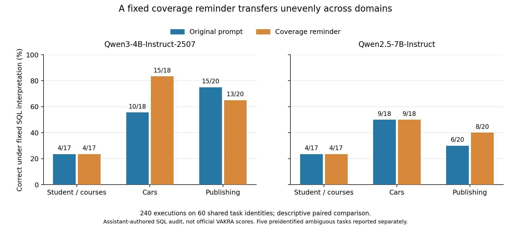
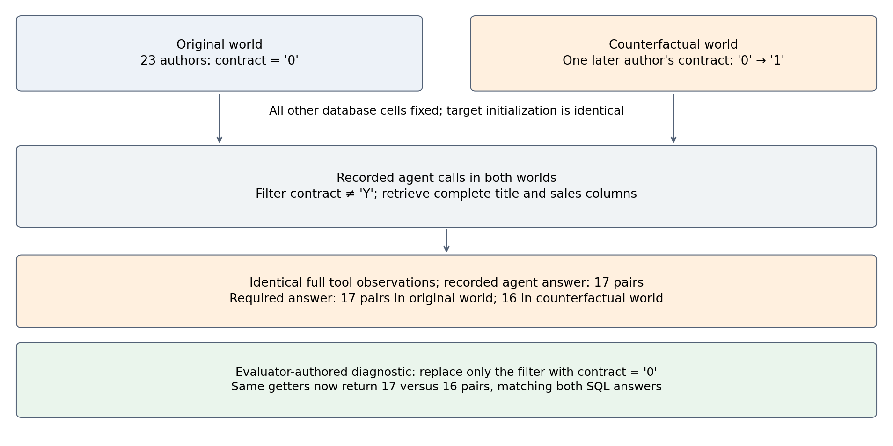

# Successful Calls, Insufficient Evidence: Scope and Coverage in Tool-Using Agents

**Working manuscript, not submission-ready.** This file develops a different
question from the historical proposal in this directory. Eight initial model
episodes, 48 matched development episodes, 240 fixed-prompt replication
episodes, 240 executor-sensitivity episodes, 240 third-model sensitivity
episodes, 120 larger-checkpoint episodes and a completed 420-episode
registered expansion across four further databases
support the present observations.
A novel method and independently confirmed benefit are not established.

## Abstract

Successful tool execution does not establish that an agent has enough evidence
to answer a question. We study public relational-tool tasks, separating
execution validity, answer correctness and identification by the observed
trace. A fixed coverage reminder has mixed domain effects. In a matched
240-episode executor control, accepting sequential call batches gives
Qwen2.5 twelve additional final answers but only one net additional correct
answer under fixed SQL interpretations. A separate SmolLM3 study produces
six correct answers among 220 scored executions. A larger Qwen3 checkpoint
scores 35/55 versus 38/55 with the reminder on the known tasks.
A prospective 420-episode expansion across four further databases yields
original/reminder counts of 24/49 versus 20/49, 14/49 versus 15/49, and
27/49 versus 29/49 across three checkpoints. All conditional paired
intervals include zero; omitting Disney reverses both positive aggregate
differences. Forty-three input-budget failures and incomplete requested lists
further delimit interpretation. Full-transcript database replays provide two
examples where a correct original answer is not identified under an explicit
admissible intervention. One retrieves every requested output value yet
applies an incorrect predicate. A bounded price-swap search adds no
correct-answer witness. These results support reporting execution,
correctness and evidence sufficiency separately, with explicit limits on
counterfactual admissibility and resource budgets. They are diagnostic
results on public training tasks, reviewed by one unblinded assistant;
they establish neither official benchmark scores, population failure
prevalence nor a new controller's superiority.

## 1. Introduction

Tool interfaces often expose both handles to server-side data and small
previews intended to help an agent decide what to do next. Such interfaces
reduce the immediate context cost of reading a table. They also require the
agent to distinguish evidence useful for choosing an operation from evidence
sufficient to answer a question. The first three values can reveal a column's
format without establishing its complete set of values.

Successful invocation and sufficient evidence are separate properties. A
syntactically valid count can faithfully report the size of the wrong table.
A correctly filtered preview can support three true membership statements
while failing to support an exhaustive list. Conversely, requesting every
value can avoid a preview omission while exhausting the inference budget.
An intervention should therefore be tested on task completion and acquisition
cost together. Merely reducing the size of a tool response is not enough.

These are established concerns in neighboring work on structured output
processing, truncation and truthful reporting. The present investigation asks
about the closed-loop choice of further evidence when a partial observation
is recoverable through additional tools. The first experiment is a simple
instruction control, rather than an unsupported claim that a new runtime
mechanism is already needed.

## 2. Evidence sufficiency is query dependent

Let D be the server-side data, q the user's requested computation, and h the
observable history of tool calls and responses. Let C(h) be the set of data
states compatible with h under the documented tool semantics. A precise
answer is identifiable from h only when q(D') is the same for every D' in
C(h). This elementary observation supplies a diagnostic definition; it is
not claimed as a new theorem or a complete decision procedure.

For an exhaustive list, a preview generally leaves compatible completions
with different additional values. A record count does not reveal those
values. For a membership question, an observed matching record can already
provide a sufficient positive witness. For a count over an already verified
scope, an exact server-provided cardinality may be sufficient without reading
every row. For an extremum, a sorted preview can suffice if the sort order,
scope and requested column are all correct. A blanket rule to fetch every
full column ignores these distinctions.

Scope correctness remains separate from coverage. An exact count over all
cities cannot answer a question about cities in England without the required
restriction. This also limits runtime certificates: a certificate about a
computation cannot, by itself, prove that its formal predicate expresses the
natural-language request. Any later method must state which obligations are
mechanically checked and which semantic interpretation remains model-dependent.

### 2.1. What a replay counterexample establishes

The compatible-world set must include a declared admissibility condition A,
not just SQL schema validity. Write O(D, a1:k) for the exact model-visible
initialization, schemas and ordered observations obtained by replaying the
recorded action sequence a1:k against D. A replay witness is an admissible
D' such that O(D, a1:k) = O(D', a1:k) but q(D) differs from q(D'). In this
study equality is checked on the full recorded tool content and error flags,
not merely on preview length, selected output fields or the final text.

For a deterministic policy with the same fresh initial model state, equality
of the full observation prefix also yields equality of its next action,
inductively. Thus the recorded path remains consistent with both worlds.
This elementary implication does not require a second expensive model run.
It does require that every differing input to the policy be ruled out: a
different preceding task in an actual cross-task memory, hidden environment
message or changed tool schema would invalidate the argument. Our target
episodes start with fresh system/user messages. Earlier independent episodes
are replayed only to reconstruct server registration state and are not model
context. For a stochastic policy the analogous statement is conditional on
the same random choices, or equality of induced action distributions, rather
than a claim of identical independently sampled trajectories.

The witness refutes identification by the specified observations within A.
It does not show that the model lacks useful prior knowledge, that its
original answer is wrong, or that the interface prevents obtaining further
evidence. An answer can be correct on D and unidentified across the admitted
worlds. Conversely, failing to find a witness in a finite search establishes
no sufficiency certificate. These restrictions are central to the empirical
audit and to its distinction from ordinary answer scoring.

## 3. Executable study setup

We use the world database and public training queries from the pinned VAKRA
release. The server code is fixed at commit
c9e82dfe46aee016d2bfe3a0c8fed652760e4c0c and the dataset at revision
1388b9f1aaed887a73957eba651a6c2034010476. The initial universe uses the upstream
reference-derived table/join initialization. This is an oracle environment
setup convention that must be disclosed. The executing agent receives the
query, schemas and initial public preview, but no answer or reference program.

The unchanged official system-prompt method is loaded separately from its
hosted-model client. A local Transformers adapter runs Qwen3-4B-Instruct-2507
or Qwen2.5-7B-Instruct with greedy decoding. Real MCP calls enforce the
upstream schemas. A logged switch to a different universe before the first
query triggers the server's dynamic getter registration; each evaluated query
then begins with a fresh universe switch and refreshed tool schemas. This
workaround does not change the tools' data semantics.

Each episode permits twenty model calls and 512 generated tokens per call.
The upstream prompt explicitly requests one tool call per iteration.
The local adapter enforces that request and accepts a final text answer, with
up to five explicitly recorded protocol errors. Tool errors, malformed output,
model failures and budget termination are retained. Terminating with a final
response is not scored as task success.

## 4. Initial observed failures

The initial batch contains four fixed queries for each of two models. Seven
episodes produce a final answer and one ends in CUDA out-of-memory. These
are execution outcomes, not a seven-of-eight success rate.

The clearest coverage failure occurs in the Turkmenistan language query.
Qwen3 filters the correct country and receives a handle with num_records=4.
The language column's first_3_values contains Kazakh, Russian and Turkmenian.
The model states that there are three languages and omits Uzbek. Offline SQL
and the released reference agree on the four-value answer. The model had
enough observable information to notice that the preview was incomplete,
although it had not yet obtained the missing value from that filtered handle.

For the England city query, Qwen2.5 successfully invokes a count on the
unfiltered City data and observes 4,079. It then reports that it cannot
determine the England count. The correct restricted count is 71, which
Qwen3 obtains in the matched query. This is an operation-scope failure rather
than malformed syntax or an inaccurate count tool.

In the highest-life-expectancy query, Qwen3 asks for a full life-expectancy
column from a 30,670-row join. The resulting 184,020-character observation
is retained verbatim, and the next model generation runs out of memory.
Qwen2.5 reaches Andorra but lists all four spoken languages without checking
the official-language condition. These observations separate resource
failure from predicate omission; neither should be hidden under one generic
tool-failure label.

The same initial batch also reveals benchmark representation concerns.
The reference uses a numeric capital-city identifier where the query requests
a city. Offline foreign-key resolution identifies the corresponding city
name. Exact string disagreement therefore cannot automatically establish
semantic error. Subsequent analysis records reference compatibility and
natural-language interpretation separately, retaining ambiguous items.

## 5. Matched simple-control experiment

The implemented development grid fixes the first twelve input queries,
two checkpoints and two conditions, totaling 48 episodes. The original
condition retains the official prompt. The coverage-check condition appends
a generic instruction to distinguish previews from full columns, verify the
requested scope, prefer filtering or aggregation before large reads, and
state unresolved evidence limitations. It adds no answer or hidden criterion.
The first four queries informed this instruction and remain development data.

Both conditions impose a 32,768-token input ceiling. Exceeding it terminates
the episode without silently truncating the observation. This ceiling is a
new matched resource constraint, so the earlier eight episodes cannot replace
the fresh original-prompt control. Output limits, checkpoint fingerprints,
tool schemas, initial observations and query identities are otherwise matched.

All 48 episodes were retained and four worker processes exited normally.
The outcome distinction materially changes the interpretation:

| Checkpoint | Prompt | Final responses / 12 | Input-limit terminations / 12 | Protocol-limit terminations / 12 | SQL-compatible answers / 11 |
|---|---|---:|---:|---:|---:|
| Qwen3 | Original | 6 | 6 | 0 | 3 |
| Qwen3 | Reminder | 10 | 2 | 0 | 9 |
| Qwen2.5 | Original | 9 | 2 | 1 | 4 |
| Qwen2.5 | Reminder | 9 | 2 | 1 | 6 |

The last column uses assistant-authored qualitative labels against SQL cards
frozen before reading these outcomes. It is neither an official benchmark
score nor independent human annotation. The denominator excludes only the
preidentified ambiguous highest-capital question; that question remains in
the twelve-episode execution totals. Under the reference's numeric-ID
interpretation, only Qwen2.5 with the reminder supplies Zimbabwe. Its successful
branch nevertheless lacks the official-status predicate, so reference
agreement must not be interpreted as proof of correct reasoning.

For the eleven questions in the answer subtotal, Qwen3 has six paired gains
and no losses, while Qwen2.5 has three gains and one loss. These are descriptive
development outcomes. Twelve shared task identities, overlapping development
queries and two related checkpoints do not support a general prevalence or
confirmatory significance claim.

Several Qwen3 gains follow a change from a full-column getter to a server-side
extremum and a filtered preview. Yet the Turkmenistan omission survives the
reminder unchanged. Qwen2.5 improves that language list by reading the complete
filtered column, but regresses on the five-country question by ignoring the
official-status restriction. Thus a prompt can improve acquisition while
still leaving the key completeness and scope obligations unresolved.

Answer correctness also does not establish evidence sufficiency. With the
reminder, Qwen3 answers the Andorra question correctly from a four-row handle's
three-row preview. The unseen fourth row still prevents that observation
alone from certifying that Catalan is the only official language. A subsequent
post-hoc counterfactual replay checks the complete target episode: changing
only Spanish's official-language flag in a local database copy preserves
the exact exposed tool schemas, initial preview and both recorded tool
responses, while changing the SQL answer from Catalan to Catalan and Spanish.
The original database is unchanged. This is one concrete witness that a
correct answer can remain unidentified by its observed tool history; it is
not a general grounding score or a prevalence estimate.

The replay preserves the worker's universe-registration order because that
order affects schema presentation. An earlier independent episode's full
column does change under the mutation; it is not part of this episode's fresh
model input. Thus the witness is episode-local and does not apply to an agent
that retains earlier tasks in memory. This boundary is recorded with the
replay artifact rather than treating all prior worker output as invisible
without checking the actual model input.

Resource effects differ across checkpoints. Original/reminder processed input
tokens are 831,487/879,648 for Qwen3 and 730,693/593,751 for Qwen2.5; generation
times are 299.21/353.06 and 359.01/265.58 seconds respectively. The complete
four-worker batch takes 390.01 seconds. Rejected over-budget inputs have no
generation usage and remain in the trace. We do not claim uniform efficiency
improvement. Full per-episode labels, reasons, raw hashes and reproduction
commands are retained with the results artifact.

## 6. Cross-database replication and initialization scope

A separately registered replication selects the three smallest previously
untested non-world capability-1 databases by file size, using twenty released
inputs per domain. The prompts and budgets are fixed before model outcomes.
All 240 model episodes complete and all twelve workers exit normally.
Pre-output reference auditing identifies literal conflicts, including
a CEO question whose reference program selects the CFO. These discrepancies
require separate semantic and reference-compatibility reporting.

The frozen SQL-interpretation subtotal excludes five preidentified ambiguous
questions, while all sixty remain in execution reporting. Per-domain counts
show limited transfer rather than a uniform reminder benefit:

| Domain | Qwen3 original / reminder | Qwen2.5 original / reminder | Fixed SQL subtotal |
|---|---:|---:|---:|
| computer_student | 4 / 4 | 4 / 4 | 17 |
| cars | 10 / 15 | 9 / 9 | 18 |
| book_publishing_company | 15 / 13 | 6 / 8 | 20 |
| Combined | 29 / 32 | 19 / 21 | 55 |

Figure 1. Descriptive answer counts under the frozen SQL interpretations.
The plotted percentages use the displayed domain-specific denominators;
executions of the same task are paired, not independent samples.

Across this subtotal, Qwen3 has five paired gains and two losses; Qwen2.5 has
four gains and two losses. Both Qwen3 losses occur in publishing: incorrect
alignment between price and title, and replacing a complete title/sales list
with a preview. Qwen2.5's reminder correctly answers the CEO question even
though the released reference identifies the CFO. These are assistant-authored
diagnostic labels, not official scores or independent human validation.
The fifty-five-question subtotal should not be called fully unambiguous:
after outcome inspection, we also noticed that "highest employee" can refer
to employee ID or job level. We retain the frozen job-level interpretation
and denominator and disclose this additional uncertainty.

Qwen3 produces final text in every replication episode. Qwen2.5 produces
51/60 original-prompt and 49/60 reminder answers; the other episodes reach
the protocol or step limit. Five final generations reach the output-token
ceiling. All three produced answers to the 187-name car enumeration are
incomplete and hit 512 tokens. Thus absence of an input-limit termination
does not imply an unconstrained answer channel.

Original/reminder input-token totals are 2,817,759/2,464,139 for Qwen3 and
3,078,581/3,079,813 for Qwen2.5. Generation times are 1,401.22/1,233.76 and
1,466.80/1,434.08 seconds respectively; the whole three-wave batch lasts
1,740.05 seconds. These totals include all registered failures.

The local one-call restriction contributes 99 of 128 recorded protocol-error
events. A post-hoc CPU replay examines each affected episode's first rejected
batch, executes its calls without repairs, and retains all outcomes.
Thirteen of 32 batches are fully executable; across 93 calls there are 32
tool execution errors. Executability does not establish semantic validity:
one executable sequence computes the unrestricted acceleration maximum instead
of the requested price-restricted one. This control diagnoses the adapter;
it does not retrospectively rescore runs or predict a batch-enabled agent.

Two questions also admit concrete witnesses of insufficient initialization.
For each, we copy the computer_student database and change one advisor's
course assignment while preserving foreign-key validity. Calling the unchanged
upstream initializer returns byte-identical serialized initial relations in
the original and modified databases, yet a query following the documented
student-to-advisor relationship returns different course lists. Each initial
relation contains seven rows. Under tools restricted to deterministic
operations on that initial relation and its descendants, the two states are
indistinguishable while requiring different answers. No prompt can guarantee
the correct answer from those observations alone.

The restriction matters: the actual MCP interface permits get_data calls with
other universe identifiers. Replaying all 27 released initializations shows
that 14 full initial relations differ under each mutation, although the
prescribed relation does not. This does not establish that a model can find
the useful universe or that its three-row preview reveals the difference.
We therefore do not claim impossibility under
the unrestricted live API, external access, or prior knowledge of the database.
The witnesses demonstrate insufficiency of the prescribed task-local initial
relation. They do not modify the original experiment databases or repair the
benchmark during evaluation. Both mutations, initial-relation hashes and
independent target SQL queries are recorded in the reproducible audit artifact.

## 7. Executor recovery does not imply answer recovery

The strict adapter rejected every generation containing multiple tool calls,
creating a material confound for Qwen2.5. We therefore repeat all 240
cross-domain episodes with sequential execution of valid batches. The task
prompt retains its per-iteration single-call instruction; only the executor
and corresponding error feedback change. We retain twenty model attempts,
twenty total executed tool attempts, the same input and output ceilings,
and every unsuccessful episode. An oversized batch is not partly executed.
Unknown tool names reject the entire batch before execution. This is a
post-outcome protocol sensitivity control on known tasks, not a faithful
reproduction of the original hosted agent or a new controller.

All task identities, schemas, initial previews, model weights and first
model inputs match the strict run. All 240 first replies are identical.
Thirty-seven trajectories diverge after their model inputs change; 213
final answers remain byte-identical. No differing reply with the same
logical input is observed before the first input divergence. The native
templates ignore tool-call IDs, which are excluded only from that logical
input comparison. We reuse answer labels for identical final text and
review all 27 changed answers against the unchanged SQL cards. Grounding
cannot be inferred from this label reuse.

| Checkpoint / prompt | Strict final answers | Sequential final answers | Strict SQL subtotal | Sequential SQL subtotal |
|---|---:|---:|---:|---:|
| Qwen3 / original | 60/60 | 60/60 | 29/55 | 29/55 |
| Qwen3 / reminder | 60/60 | 60/60 | 32/55 | 32/55 |
| Qwen2.5 / original | 51/60 | 56/60 | 19/55 | 19/55 |
| Qwen2.5 / reminder | 49/60 | 56/60 | 21/55 | 22/55 |

The twelve additional Qwen2.5 final answers yield only one net additional
SQL-compatible answer. Under the original prompt, recovering the correct
publisher count is offset by losing the price-restricted maximum
acceleration. Under the reminder, a previously absent answer becomes a
correct USA response. Its explanation assumes the country code, so answer
correctness does not establish grounded evidence acquisition. Other
recovered answers omit required rows, misalign fields, or use unrestricted
data. The frozen subtotal excludes five previously identified ambiguities;
it does not imply that all remaining questions are unambiguous.

Qwen2.5 protocol errors decrease from 127 to 31 while tool attempts increase
from 315 to 455. Model attempts decrease from 542 to 498. Input and output
tokens decrease from 6158394 to 5693901 and from 54925 to 53818, respectively.
These resource dimensions do not support an unqualified efficiency claim.
An overlapping model download also prevents treating batch wall time as an
isolated speed comparison. The control removes one execution restriction
without establishing broad answer reliability or the novelty of our prompt.

## 8. Counterfactual admissibility and a failed broad audit

A bounded automatic search provides a useful negative control for the
interpretation of counterfactual witnesses. On ten known world tasks and
all four model/prompt arms, the generator uses evaluator-side SQL to propose
same-column value replacements and swaps, excluding declared keys. It
retains at most eight answer-changing candidates from 2,048 seeded draws
per task. The any-five task and ambiguous highest-capital task are excluded
before replay, and target SQL projections remove auxiliary audit fields.

All forty original trajectories replay exactly. Fifty-eight mutant databases
and 141 mutant replays yield seventeen observation-preserving witnesses.
Ten concern episodes without final answers, three concern previously
incorrect answers, and four concern previously correct answers. These
figures are not a grounding-failure rate. All four correct-answer cases
change geographical membership: a Japanese district becomes England, or
Rwanda becomes a Baltic country. The models instead use ordinary country
membership knowledge to scope their tools. Schema validity alone fails to
capture that background constraint. A query that agrees with the question
on the original database need not remain a valid interpretation on every
schema-valid mutant.

The automatic search also misses the separately verified Spanish-official
witness. Its retained candidates for that task alter other fields. Thus
failure to find a mutation is empirically not a sufficiency certificate.
The broad audit is retained as a development failure: useful counterfactual
measurement needs an explicit admissible-world contract as well as adequate
search. Neither changes the original model-answer scores.

A subsequent development control fixes every cell except one official-language
status flag. Exhaustively checking the 984 existing flags yields four
answer-changing candidates for the life-expectancy query and one for the
smallest-country query. Replaying all four arms recovers the known
Spanish-official witness with an identical complete-observation digest.
Across these eight episodes, six have a witness, but four have no final
answer and one has an incorrect answer. The sole correct-answer case is the
already known positive control. This shows that a narrower mutation contract
can recover a useful witness while preserving geography; it does not supply
independent evidence of prevalence or a complete sufficiency decision.

### 8.1 Complete output retrieval can hide a wrong predicate

Figure 2. Real MCP replay preserves all target observations under a declared
single-author contract-status intervention, while the required answer changes.
The final answer shown is the recorded original answer, not a fresh neural
generation in the mutant world. The bottom diagnostic is evaluator-authored
and proves that the existing tools offer a distinguishing path; it is not an
autonomous repair result. Figure source values and hashes accompany the plot.

A second-domain development audit fixes a different admissible mutation
class: one author contract flag may change from `0` to `1`, while all other
database cells remain fixed. All twenty-three original author flags are
zero; admitting one is an explicit counterfactual assumption. Across the
two contract-related publishing questions and four model/prompt arms, all
eight original trajectories replay exactly. Exhaustive single-author flips
produce fourteen answer-changing task/mutation pairs; twenty-nine replay
trials find six observation-preserving witnesses. Only one of those six
episodes originally answers correctly, so six of eight is not an
unsupported-correct-answer rate.

In that correct Qwen3/original episode, the agent selects authors whose
contract value is not `Y`, then retrieves both complete output columns.
Its seventeen distinct title/sales pairs are correct on the released
database. Changing a later author's contract flag to `1` removes one title
from the required answer but preserves all three tool responses and the
entire initial observation. The erroneous predicate remains invisible
because both zero and one differ from `Y`. This example cannot be diagnosed
solely by checking whether the final output columns were fully retrieved.

The existing equality-filter tool with value `0`, followed by the same two
getters, yields seventeen versus sixteen pairs and matches the SQL answer
in both worlds. This evaluator-supplied CPU repair establishes that the
interface can distinguish the worlds. It does not show that a model learns
or autonomously generates the repair. As in the language-status example,
the target episode starts with fresh messages and the claim is local to
its observed trajectory, not arbitrary prior knowledge or all possible
interactions with the API.

### 8.2 Price-preserving swaps do not extend the correct-answer witnesses

We additionally restrict the car-domain intervention to swapping two existing
positive prices. This preserves the full price multiset, all other cells,
row counts and declared key constraints. The explicitly admitted change is
the association between car identity and price; it is a synthetic-world
assumption, not a historical market claim. A fixed task-seeded stream proposes
at most 2,048 pairs and retains the first eight SQL-answer-changing swaps per
task, without consulting the agent trace. All twenty tasks and all eighty
existing sequential-executor episodes remain in the audit.

All eighty original replays match. Ninety-nine task-specific mutant databases
yield ten witnesses in 332 mutant replays, stopping at the first witness for
each episode. All ten witnesses belong to already incorrect answers; none
of the 43 SQL-compatible correct-answer episodes receives a witness. Thus
this control does not add a correct-but-unsupported example. Its negative
result limits generalization from the two earlier examples. Nor does the
absence of a witness certify sufficiency: the candidate grammar changes only
price associations and the search is bounded. Seven tasks have no retained
answer-changing candidate. The repeated executions cannot be treated as
eighty independent tasks or as a population prevalence estimate.

## 9. A third model exposes a performance-floor limitation

We repeat the same sixty public tasks with SmolLM3-3B at pinned revision
`a07cc9a04f16550a088caea529712d1d335b0ac1`, crossing both prompts with both
executors. Its native no-thinking tool template is fixed before the batch;
all nine model files match their recorded hashes. A separate two-turn toy
check confirms that the adapter can receive a valid tool call and return a
final answer. The twenty-call, twenty-step, 512-new-token and 32,768-input-token
limits remain unchanged. All twelve workers complete all 240 registered runs.

| Executor | Prompt | Final responses / 60 | SQL-compatible answers / 55 | Excluding qualified predictions |
|---|---|---:|---:|---:|
| Single-call | Original | 54 | 0 | 0 |
| Single-call | Reminder | 58 | 1 | 0 |
| Sequential batches | Original | 54 | 1 | 1 |
| Sequential batches | Reminder | 55 | 4 | 3 |

Every answer is reviewed against the previously fixed interpretation cards.
Many final responses contain only a procedure or an unexecuted tool proposal,
which does not answer the question. Nineteen episodes have no final response:
twelve reach the protocol-error limit, five the tool budget, and two the step
limit. No OOM or input-budget termination is observed. Two credited responses
predict USA with qualified language and propose subsequent verification;
the content-based answer rubric credits the country without claiming it was
established by retrieved evidence. The last column removes both predictions
as a sensitivity analysis. The same five preidentified ambiguous tasks stay
outside the SQL subtotals and inside execution totals.

All 120 executor-paired first replies are identical. Sequential execution
increases tool calls from 49 to 307 and reduces protocol errors from 127 to 73,
aggregated across prompts. Yet the scores remain near the floor. Sixty-six
final responses reach the output-token ceiling; the saved logs do not retain
terminal token IDs, so reaching the ceiling is not itself a certified
truncation event. These results concern this adapter, template and resource
setting. They neither rank general model ability nor establish that the
reminder reliably helps a different model family. The known tasks, single
deterministic run per cell and severe floor limit the value of this experiment
as a generalization test. The model-download overlap also prevents an isolated
wall-time comparison. Full raw hashes, literal annotations and sensitivity
counts are preserved in the third-model evidence bundle.

### 9.1 Task pairing and conditional uncertainty

Repeated executions are not independent tasks. We retain all prompt pairs
on the same 55 fixed-SQL tasks and resample whole tasks within each of the
three observed domains, preserving each task's six model/executor comparisons
together. The following percentile intervals use 10,000 resamples and a fixed
seed. They describe task composition conditional on these domains and fixed
assistant labels; they do not cover annotation uncertainty, model-seed
variation or unseen-domain sampling.

| Checkpoint | Executor | Reminder wins / losses | Difference (percentage points) | Conditional 95% bootstrap interval |
|---|---|---:|---:|---:|
| Qwen2.5 | Single-call | 4 / 2 | +3.64 | −5.45 to +12.73 |
| Qwen2.5 | Sequential batches | 5 / 2 | +5.45 | −3.64 to +14.55 |
| Qwen3 | Single-call | 5 / 2 | +5.45 | −3.64 to +12.73 |
| Qwen3 | Sequential batches | 5 / 2 | +5.45 | −3.64 to +12.73 |
| SmolLM3 | Single-call | 1 / 0 | +1.82 | 0.00 to +5.45 |
| SmolLM3 | Sequential batches | 3 / 0 | +5.45 | 0.00 to +12.73 |

Every interval includes zero. SmolLM3's lower endpoints at zero reflect its
near-floor paired outcomes, not a guarantee of nonnegative transfer. Leaving
out one domain is a separate sensitivity check: Qwen3's difference changes
from +14.29 points without publishing to −5.41 without cars, under either
executor. This sign reversal limits an aggregate prompt-benefit claim.
The intervals are descriptive; no population-significance claim follows
from these small, deliberately selected databases.

## 10. Frozen extensions and their interpretation

The performance floor of SmolLM3 and the small number of databases motivate
two separately registered extensions. Their design was fixed after the
developmental results above; they are not retroactively described as part of
the original study. The known-task checkpoint extension is complete; the
prospective domain extension is also complete; its separately registered
output-budget control remains pending.

### 10.1 A larger checkpoint on the known tasks

We retain all sixty tasks from the three-domain comparison and both fixed
prompts, using the sequential executor, and replace the target checkpoint
with Qwen3-30B-A3B-Instruct-2507. Its exact revision and every model-file hash
are pinned. The 120 executions retain the twenty-step/tool-call limits,
512 new tokens per generation and 32,768-token input limit. One inference
worker uses two A40 devices with all model layers resident on the GPUs;
two workers can run concurrently. This is a checkpoint comparison on known
tasks. Differences in architecture, training and model capacity prevent its
interpretation as a causal scaling experiment.

All six workers completed, producing 120 episode records. The complete
archive passed grid, immutable source, checkpoint, task identity and
initial-input pairing checks. The same unblinded assistant reviewed every
answer against the previously frozen SQL interpretations. Five ambiguous
tasks per arm remain outside primary answer accuracy, while all executions
remain in completion and resource counts.

| Domain | Scored tasks per prompt | Original correct | Reminder correct |
|---|---:|---:|---:|
| computer_student | 17 | 5 | 6 |
| cars | 18 | 13 | 14 |
| book_publishing_company | 20 | 17 | 18 |
| All three | 55 | 35 | 38 |

The paired difference is 5.45 percentage points (five gains, two losses,
48 ties). A 10,000-draw task-paired bootstrap stratified by these fixed
domains gives a conditional percentile interval of [-3.64, 14.55] percentage
points. Leaving out any one domain yields differences between 5.26 and 5.71
points. These calculations condition on the assistant's labels and the
observed domains; they do not establish a population benefit or cover
annotation uncertainty and generation-seed variability.

The original arm produced 58 final answers and two protocol-error-limit
terminations; the reminder arm produced 60 final answers. Across all sixty
executions per arm, original/reminder totals are 302/261 model generations,
233/203 tool calls, 3,558,198/2,949,286 input tokens and 37,437/29,930 output
tokens. Summed generation times are 6,864.46/5,540.52 seconds, with 13/0
recorded protocol errors. Summed worker generation time is not elapsed
batch time or a hardware-normalized comparison with earlier checkpoints.

Higher answer scores do not validate intermediate derivations. For publishing
task 012, the reminder arm returns the SQL-compatible title and price while
its stated reasoning uses a maximum individual sale instead of the reference
aggregate sales. We score the requested answer as correct under the fixed
policy and make no positive grounding judgment. Both prompts also produce
incomplete requested lists in the student and car domains. This checkpoint
therefore reduces the observed scoring floor without removing the distinction
between completion, answer agreement and evidence support.

### 10.2 Prospective database expansion

At the fixed VAKRA data revision, we excluded the four databases already
used in development and retained capability-1 training domains whose SQLite
file is at most 5,000,000 bytes. A seeded hash ordering selected the first
four eligible domains before their task answers were inspected. Within each
domain, a fixed task hash ordering selects at most twenty tasks, without
answer-dependent replacement: cookbook (20), disney (20), genes (10), and
ice_hockey_draft (20). These seventy public training examples are new to
our experiments; they are not guaranteed absent from model pretraining.

The registered grid uses Qwen3-4B, Qwen2.5-7B and Qwen3-30B-A3B with both
prompts and the sequential executor, yielding 420 episodes. Small-model
near-floor findings motivated omitting SmolLM3 from this extension, which
limits any claim that checkpoint selection was independent of development.
The prompts and all primary execution budgets remain unchanged.

Before model outputs, we executed the reference SQL, reviewed the task
wording and recorded interpretation cards. Twenty-one tasks have a marked
wording/reference ambiguity. All seventy tasks remain in execution and
resource accounting; the primary fixed-SQL comparison uses the other
forty-nine tasks per model/prompt arm. Thus 294 registered executions enter
that comparison and 126 remain separately reported ambiguous cases. This
mask is fixed before predictions, and no answer-length exclusion is added.
The cards are evaluator-side material and never enter model prompts. Their
assistant-authored judgments still require the annotation limitations stated
in the earlier study.

### 10.3 Output-budget sensitivity selected before predictions

Reference inspection identifies two complete-list tasks whose answers can
exceed the primary generation ceiling. Under each of three explicit
serializations using the pinned Qwen30B tokenizer, cookbook task 001 contains
791 names and takes 5,047–5,406 tokens; ice_hockey_draft task 000 contains
129 names and takes 646–649 tokens. These measurements are not a proof that
every semantically equivalent answer requires that many tokens, nor do they
measure the other checkpoints' tokenizers.

We registered a separate 8,192-new-token rerun for both tasks under all
three checkpoints and both prompts, twelve executions in total, independent
of their primary outcomes. All other budgets and inputs remain fixed. Because
the MCP session can retain preceding task state, the rerun replays preceding
tool history without model inference and requires exact equality of the
target's initial messages, ordered tool definitions and preview before
generation. A mismatch invalidates the matched comparison and is retained
as a failure to pair. The original primary result remains unchanged.

The changed ceiling applies to every generation in the target episode,
including tool-call generation. Any improvement would therefore establish
output-budget sensitivity, not isolate final-answer space or demonstrate a
new evidence-acquisition method. Complete results and pairing checks remain
pending.

### 10.4 Completed cookbook slice of the registered expansion

The six cookbook workers completed all twenty tasks under both prompts and
all three checkpoints. We extracted this complete domain while the other
registered domains were still running. The archive contains all 120 episodes,
six successful worker exits and a snapshot of the still-running grid manifest.
The offline analyzer explicitly marks this as a closed domain, not a completed
420-episode experiment. Selection, prompts and budgets were unchanged; all
sixty within-checkpoint task pairs have matching initial inputs apart from the
registered reminder. No subsequent prompt or task selection uses these answers.

| Checkpoint | Original correct | Reminder correct | Gains | Losses |
|---|---:|---:|---:|---:|
| Qwen3-4B | 9/16 | 8/16 | 0 | 1 |
| Qwen2.5-7B | 7/16 | 7/16 | 0 | 0 |
| Qwen3-30B-A3B | 11/16 | 11/16 | 0 | 0 |

The four premarked ambiguous tasks remain excluded only from accuracy. All
120 executions finish with a final answer, with no protocol errors or final
generation at the 512-token ceiling. The full qualitative review records 53
correct, 43 incorrect and 24 ambiguous executions. It is a single unblinded
assistant review against the frozen SQL cards, not independent human annotation.
There is no observed benefit in this small domain, and these checkpoint
differences do not isolate model size. We do not pool repeated task executions
as independent examples or extrapolate sixteen scored tasks to all databases.

Task 001 requires 791 recipe names under the reference interpretation. Every
arm returns only three examples. The absence of a ceiling-length final does
not establish that a larger generation allowance would have no effect; the
separately registered matched budget rerun remains pending.

The slot-filling interface also matters. In task 015, the larger checkpoint
under the reminder repeatedly retrieves an ingredient column but receives a
handle with ten records and three preview values. It then supplies its own
ten-name array to `select_unique_values`. The tool returns that array without
error, and the final response repeats it as the complete retrieved list.
Inspection of the unchanged helper shows that it only deduplicates the input
array. Several entries disagree with the reference ingredients even after
allowing cumin/cinnamon aliases. A successful helper response therefore adds
no independent database observation in this case. This post-review illustration
is not a formal grounding score or an estimate of failure prevalence. Unlike
the publishing getter in section 8.1, cookbook `retrieve_data` itself returns
a preview; we have not established that all complete-list tasks are impossible
through other available tool sequences. The following control tests that
possibility for this selected task.

### 10.5 An executable acquisition control within the existing budget

We replayed all six task-015 histories through the unchanged native MCP
implementation, including each worker's warmup and fifteen preceding independent
episodes. All 224 preceding tool responses, the target initial observations,
ordered schemas and target prefixes matched the recorded content and error
flags. Each target prefix reaches the correct maximal-cooking-time filter;
two prefixes include an earlier unsuccessful tool attempt.

From that filtered handle, an evaluator-authored routine sorts by ingredient
name and repeatedly filters to names greater than the last visible value.
This is ordinary keyset pagination, not a new algorithm. The routine reads only
tool responses and receives no reference answer. It requires stable data,
non-null string values, consistent ordering and accurate row counts. Distinct
names are collected until the remaining row count fits the preview. Budget
exhaustion returns an explicitly incomplete result; malformed or nonprogressing
observations fail rather than certify completion.

All six controls obtain the ten reference ingredients in four added calls:
one sort and three filters, with remaining row counts 10, 7, 4 and 1. Total
target calls are six in four histories and seven in two, including unsuccessful
prefix attempts, below the original twenty-call ceiling. A separate validator
reconstructs the values from saved MCP responses and checks them against both
the frozen card and read-only SQL. The database hash is unchanged.

Thus the tested interface can expose the complete answer for this selected
question within the call budget. The failure is not forced by an unavailable
full-column getter alone. This does not isolate why the models failed: the
evaluator chose the predicate checkpoint and output column after reviewing
the answers, and no model continued from the repaired observations. Six
histories of one question are not six independent tasks, and the control
establishes neither a model success-rate gain nor general semantic sufficiency.

### 10.6 Completed Disney slice and judgment sensitivity

All six Disney workers also completed the registered twenty-task grid. The
120 raw records, six successful worker exits and sixty matched initial
prompt pairs pass the same source, model and protocol checks as cookbook.
This slice was first analyzed before the complete grid closed; the final
420-run analysis appears in section 10.9. Tasks 001 and 014 retain their pre-run popularity
ambiguity labels, leaving eighteen scored tasks per arm.

| Checkpoint | Original correct / scored | Reminder correct / scored | Paired gains / losses | Finals, original / reminder |
|---|---:|---:|---:|---:|
| Qwen3-4B | 12/18 | 9/18 | 1 / 4 | 20 / 20 |
| Qwen2.5-7B | 5/18 | 7/18 | 4 / 2 | 18 / 19 |
| Qwen3-30B-A3B | 12/18 | 15/18 | 3 / 0 | 18 / 19 |

These are requested-value matches against the frozen SQL interpretation,
assigned by one unblinded assistant after reading every full response. The
120 executions comprise sixty correct labels, forty-six incorrect labels,
twelve ambiguous labels and two scored tasks without an answer. There are
six absent final answers in total: four concern the ambiguous task 014 and
remain recorded in execution accounting. Four episodes terminate at the
protocol-error limit and two at the step limit. The complete records contain
twenty-six protocol errors. Two final responses reach the 512-token ceiling,
both under the original prompt; neither is silently discarded.

Requested-value agreement can coexist with contradictory explanation. For
task 012, both larger-checkpoint responses give the correct count of two
while naming the wrong supporting films. For task 003, the original Qwen3
response guesses the matching PG rating while attributing Turbo to the
wrong movie, and ends at the generation ceiling. Three responses to task
009 explicitly provide both required songs but subsequently emphasize one.
The primary audit records these as requested-value matches, without a
grounding or explanation-correctness claim. All such decisions are visible
in the per-response annotation reasons.

We additionally disclose a conservative, post-review sensitivity that
relabels eight borderline responses as incorrect: the six just described,
the title-list response that enumerates two release years for 101 Dalmatians,
and a correct release-date response that earlier denies a matching record.
With all eight changes applied together, the original/reminder counts become
9/18 versus 8/18 for Qwen3, 5/18 versus 6/18 for Qwen2.5, and 10/18 versus
14/18 for Qwen30B. The checkpoint-specific directions remain unchanged.
This secondary reading does not replace the fixed audit, establish human
agreement, or bound every possible adjudication. It exposes where a
different response-level standard would change the reported counts.

Disney therefore adds a negative Qwen3 comparison and positive Qwen2.5 and
Qwen30B comparisons under both disclosed readings. Twenty tasks from one
database, with a fixed eighteen-task denominator, do not establish a
population prompt effect or identify its mechanism. The separate
output-budget control is not incorporated as a completed result here.

### 10.7 Completed genes slice and scoring-floor limits

All six genes workers completed the ten-task grid, and all thirty matched
initial prompt pairs passed the immutable input checks. The sixty executions
produced fifty-four final answers, five step-limit terminations and one
protocol-error-limit termination. Ten protocol errors occurred in total;
none of the final answers reached the 512-token generation ceiling. All
six missing finals belong to the seven tasks classified as ambiguous before
model execution. Their forty-two executions and costs remain in the record,
while answer accuracy has the fixed denominator of three tasks per arm.

Both prompts score 0/3 for each of Qwen3, Qwen2.5 and Qwen30B. All eighteen
scored executions have final answers, so this result is not caused by
missing responses. For the complete-list question, responses either deny
matching genes or name only two distinct identifiers and an unspecified
remainder, whereas the fixed SQL returns fifty-two distinct GeneIDs. For
the nucleus question, responses report 954 or 1034 rather than the required
184 distinct non-essential genes. For the minimum-correlation pair, every
response omits at least one required gene function; several name the two
genes and two functions but omit the additional PROTEIN SYNTHESIS function.

These are failures under the declared requested-value interpretation,
assigned after reading all complete responses by one unblinded assistant.
They do not certify a causal explanation from the tool traces. Three scored
tasks at a common zero floor cannot establish equivalence between prompts,
general ineffectiveness, or a population failure rate. The high pre-run
ambiguity fraction further limits this domain's role in generalization.
We retain this result without changing interpretations or replacing tasks
after observing answers. The complete-grid comparison below retains these
labels unchanged.

### 10.8 Ice hockey: resource failures and complete-answer requirements

The final six workers complete all 120 ice-hockey executions. The eight
preidentified ambiguous questions remain outside answer accuracy, leaving
twelve scored tasks per arm. All 120 complete final responses or absences
are reviewed against the frozen cards; no task is replaced or reinterpreted.

| Checkpoint | Original correct / scored | Reminder correct / scored | Paired gains / losses | Finals, original / reminder |
|---|---:|---:|---:|---:|
| Qwen3-4B | 3/12 | 3/12 | 2 / 2 | 11 / 13 |
| Qwen2.5-7B | 2/12 | 1/12 | 0 / 1 | 15 / 16 |
| Qwen3-30B-A3B | 4/12 | 3/12 | 1 / 2 | 8 / 13 |

There are 76 final responses, 43 input-budget terminations and one step-limit
termination. Thirty missing answers are on scored tasks and remain in their
denominators; the other fourteen concern preidentified ambiguities. Every
input-budget failure follows at least one successful generation: 23 occur
after one, fourteen after two, and three each after three or four. The saved
executor checks report attempted contexts of 32,849 to 161,160 tokens against
the unchanged 32,768-token limit. These are recorded budget measurements, not
independent retokenizations. They show a constraint on continuing interaction;
they do not justify discarding the failed tasks or assigning their intended
answers.

For the preflagged 129-player list, all six final responses omit required
names. Both Qwen2.5 responses name only three players; the other four provide
long incomplete enumerations. Seven finals in the domain reach the generation
ceiling. The requested mapping of twenty distinct Oshawa players to their
heights is also not satisfied by a repeated list of season-row heights or a
two-player sample. These outcomes retain the complete-answer rules fixed
before generation. They do not prove that every semantically equivalent
serialization must exceed the budget; the registered longer-output control
will address one part of that question.

Completion and correctness again differ. The larger checkpoint produces
five more finals with the reminder but one fewer correct answer. Its
oldest-player response lists the relevant birthdates yet explicitly selects
Alexander Svitov instead of Yegor Shastin. The original prompt selects Shastin
correctly. Listing a correct candidate inside a contradictory selection is
not credited as the requested single answer. No causal explanation for this
prompt-dependent error is inferred from that example.

### 10.9 Complete prospective expansion and conditional uncertainty

All 24 workers exit successfully, producing the exact 420 registered records
and 210 verified initial prompt pairs. The complete archive retains 364 final
responses, forty protocol errors and nine finals at the generation ceiling.
The earlier 300 cookbook, Disney and genes labels are transferred unchanged
after matching every episode hash. The fixed 21-task ambiguity mask excludes
126 executions from answer accuracy while retaining all costs. Thus each arm
has 49 scored tasks across the same four databases.

| Checkpoint | Original correct | Reminder correct | Gains / losses | Difference (pp) | Conditional 95% paired bootstrap interval (pp) |
|---|---:|---:|---:|---:|---:|
| Qwen3-4B | 24/49 | 20/49 | 3 / 7 | -8.16 | [-20.41, 4.08] |
| Qwen2.5-7B | 14/49 | 15/49 | 4 / 3 | +2.04 | [-8.16, 12.24] |
| Qwen3-30B-A3B | 27/49 | 29/49 | 4 / 2 | +4.08 | [-4.08, 14.29] |

For this descriptive analysis, we compute the exact finite distribution of
the stratified paired bootstrap. Each task pair contributes -1, 0 or +1 for
reminder-minus-original correctness. Within each of the four fixed domains,
we resample its observed number of scored pairs with replacement, then sum
over domains and divide by 49. Convolution with rational probabilities gives
the 2.5th and 97.5th percentiles without Monte Carlo approximation. A small
exhaustive-resampling check validates this calculation. This is an ordinary
conditional bootstrap calculation, not a new estimator or a preregistered
hypothesis test. It does not cover unseen-domain sampling, model randomness
or annotation uncertainty, and we make no multiplicity-adjusted superiority
claim across checkpoints.

Every interval contains zero. Omitting Disney gives a net difference of
-1/31 tasks (-3.23 points) for each checkpoint, reversing the two positive
full-grid differences. Applying the eight previously disclosed conservative
Disney label changes, without adding new changes, produces counts 21/49
versus 19/49, 14/49 versus 14/49, and 25/49 versus 28/49 respectively; all
three corresponding conditional intervals still include zero. These checks
restrict the aggregate prompt-benefit interpretation. They do not establish
prompt equivalence or erase the within-domain gains and losses.

## 11. Related work and limits

[Agents Don't Paginate](https://arxiv.org/html/2608.26130v1) studies first-chunk
selection and a file-localization probe. Our query-coverage question involves
continued interaction, but this difference alone is not a contribution.
[Fabrication After Tool Failure](https://arxiv.org/html/2609.14758v1) already
evaluates explicit failure-status and verification instructions after unusable
payloads. Our simple prompt is a control within that established design space.
[How Good Are LLMs at Processing Tool Outputs?](https://aclanthology.org/2026.eacl-long.134/)
compares answer generation with executable code and several response
representations. Executable processing must be a serious baseline for a
proposed evidence-acquisition controller.

Benchmark attribution is also established prior work.
[ELT-Bench-Verified](https://arxiv.org/abs/2603.29399) combines automated
diagnosis with human validation to investigate specification, reference and
evaluation defects. [AgentJudgeBench](https://arxiv.org/abs/2608.26623)
examines judge reliability for tool workflows, including adverse effects of
reference exposure. Our offline disagreement audit is a measurement safeguard,
not a claim to introduce either benchmark auditing or reference-bias analysis.

VAKRA's own [evaluation description](https://huggingface.co/blog/ibm-research/vakra-benchmark-analysis)
already checks executed trajectories, recovered information and final-answer
grounding. The local SQL-compatible counts in this manuscript do not replace
that pipeline. In particular, our passive lineage instrument cannot infer
every valid cross-column deduction or certify natural-language scope.

[Blockaid](https://www.usenix.org/system/files/osdi22-zhang.pdf) already
formalizes trace-conditioned database determinacy and checks it with SMT.
Our observation-equivalence definition is an application of established
ideas, not a new theorem. [GroundEval](https://arxiv.org/html/2606.22737v2)
already scores state-dependent evidence obligations using reviewed contracts.
[HERALD](https://arxiv.org/html/2608.06012v1) uses controlled retrieval-trace
interventions and separates visible from oracle information. The intended
relational-data audit therefore requires empirical and operational value
beyond generic trace checking or counterfactual terminology.

[EG-VAR](https://arxiv.org/html/2607.12650v1) derives Lean-checked claims from
attested tool payloads through trusted source-specific formalization. Its
trust boundary separates kernel acceptance from errors in the data-to-logic
translation. Thus proof-backed tool grounding is already occupied; our
trace-preserving database audit does not introduce that idea. We have read
the method and scope but have not reproduced its implementation.

[Semantic Evaluation for Text-to-SQL with Distilled Test Suites](https://aclanthology.org/2020.emnlp-main.29/)
already addresses accidental agreement on a single database by evaluating
queries on multiple databases. An interactive trace-preserving witness has
a different target from a fixed SQL-program comparison, but neither data
mutation nor distinguishing accidental correctness is new by itself.

The evidence comprises development on one database and fixed-prompt
comparisons on three deliberately small databases, with three Qwen checkpoints
and SmolLM3, plus a complete prospective expansion across four further databases.
SmolLM3 is near floor, and the six earlier paired prompt
comparisons have descriptive intervals that include zero. Broad
generalization, a formal semantic verifier and an official VAKRA score are
not established. The
assistant-authored SQL audit is an explicit diagnostic instrument, not an
independent human annotation study. It uses hidden answers only offline.
Further experiments require a fixed method, additional task families, full
cost accounting, stronger controls and uncertainty estimates appropriate to
the actual number of independent tasks.

## 12. Discussion

### 12.1 Three distinct evaluation questions

The experiments answer separate questions about an episode: did the agent
complete a valid interaction, did its answer match the fixed task interpretation,
and did the recorded observations determine that answer within the admitted
worlds? Improvements on one axis need not establish improvements on another.
Permitting sequential batches increases Qwen2.5's final-response count by
twelve while adding only one SQL-compatible answer. The two complete-history
counterexamples instead begin with correct answers and show an evidential
distinction invisible to the answer label. Neither observation licenses
replacing task success with a trace-based score.

The coverage reminder changes a policy's acquisition decisions as well as its
final response. Its mixed domain effects cannot be attributed exclusively to
preview handling. In publishing, complete retrieval of the output columns
coexists with an incorrect predicate. The repaired filter used in our CPU
diagnostic establishes an available distinguishing action, but does not show
that an agent can reliably choose it. A practical controller would need to
address this semantic choice and its cost, beyond detecting an incomplete
preview.

### 12.2 Counterexamples are local audit evidence

A replay witness is useful because its claim can be checked against complete
recorded inputs, actual tool semantics and an explicit database intervention.
It does not require interpreting the model's hidden reasoning. This benefit
depends on faithfully defining the admissible alternatives. The failed broad
search illustrates the cost of ignoring background constraints: a syntactically
valid database edit can invalidate the natural-language interpretation used
to score the answer. We retain these rejected candidates to distinguish a
debugging discovery from evidence eligible for the scientific claim.

The two retained correct-answer witnesses establish existence under their
declared intervention classes. Their post-hoc selection, the bounded searches
and the failed car-domain extension preclude a prevalence estimate. Equally,
the absence of a found witness is not evidence that the remaining answers
were identified. The tool is an audit instrument that produces inspectable
counterexamples, not a complete verifier. Mechanically generated evidence
should preserve these limits rather than turn search failure into a positive
grounding certificate.

### 12.3 Practical implications within the tested setting

Evaluation records should retain execution outcomes and costs for every
registered task, including ambiguous tasks whose answer interpretation is
reported separately. They should also state whether a resource limit can
constrain answer expression, whether initialization uses a reference-derived
scope, and whether a local adapter restricts otherwise legal tool sequences.
The present controls show that these choices affect the meaning of a reported
result. They do not establish a universally optimal executor, prompt or budget.

The completed larger-checkpoint extension improves absolute answer scores on
the known tasks but leaves its conditional prompt-effect interval overlapping
zero. The completed cookbook slice shows no prompt benefit; its acquisition
control demonstrates one feasible complete retrieval, without a model repair
claim. Disney has mixed checkpoint-specific prompt effects, including under
the disclosed conservative answer-review sensitivity. Genes is at zero on
all three scored tasks for every arm, limiting comparison at that floor.
Ice hockey adds no net reminder benefit on any checkpoint. The complete
four-database expansion retains mixed aggregate effects and conditional
intervals that include zero; the output-budget extension remains pending.
Larger sample counts
will not by themselves resolve assistant annotation bias, identify the cause
of a prompt effect, or demonstrate a new method's superiority.

## 13. Provisional conclusion

In the completed small-database studies, successful calls, correct answers
and sufficient observed evidence are empirically distinct. A fixed reminder
has mixed effects, relaxing one executor restriction mainly improves response
completion, and SmolLM3 performs near the scoring floor. A larger Qwen3
checkpoint improves absolute scores on the known tasks, while its paired
reminder comparison remains inconclusive. Cookbook shows no reminder gain,
and Disney has mixed checkpoint-specific effects; genes yields no correct
answers on its three scored tasks in any arm. Ice hockey has neutral or
negative reminder differences alongside substantial input-budget failures.
The completed prospective expansion does not establish a consistent aggregate
benefit; both positive differences reverse when Disney is omitted.
A selected cookbook control retrieves all required
values through existing tools within budget, limiting an interface-impossibility
interpretation. Two
fully replayed examples show that a correct original answer can remain
unidentified under an explicit admissible intervention, including after full
output-column retrieval. These findings support more explicit evaluation and
auditing of relational tool use. They do not yet establish a general evidence
controller, a benchmark-wide failure rate or confirmatory benefits on the
pending output-budget control.
